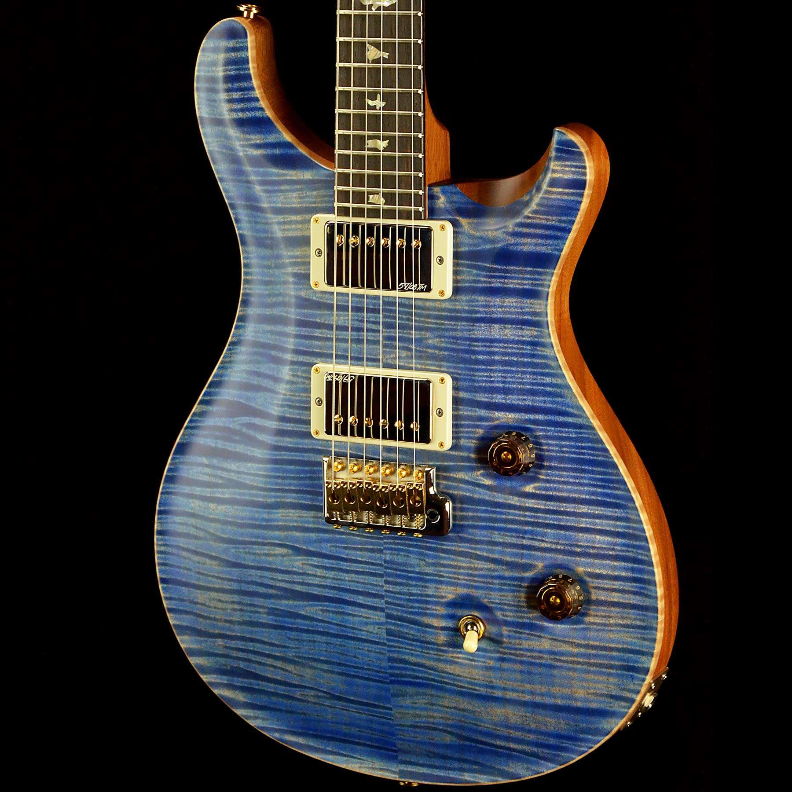
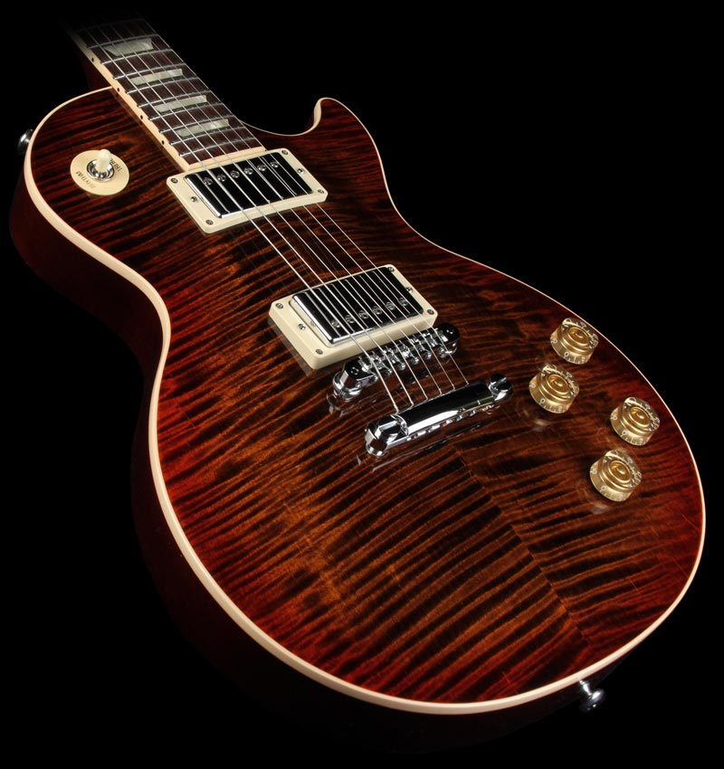

# Specs for Prototype A and T:

## Proto A (Alex's Guitar)

* Les Paul body shape
* Figured maple neck
  * scarf joint (headstock)
  * deep set neck tennon
  * book-matched 
* Ebony headstock veneer 
* Rosewood fretboard 
* Redwood body (2-piece)
* Book-matched flamed maple top (3/4")
* Wrap-around bridge (nickel)
* Locking Grover tuners (nickel) (ebony buttons)
* Humbucker pickups
* 3 ebony knobs
* 3-way selector switch
* Maple control cover
* Graph tech nut
* no front inlays
* Steel side inlays
* Curved top heatock design
* silver "burlington guitar co." headstock inlay
* masked maple binding

## Proto T (Timmy's Guitar)

* Les Paul body shape
* Figured maple neck
  - scarf joint (headstock)
  - deep set neck tennon
  - book-matched 
* Redwood headstock veneer 
* Ebony fretboard 
* Redwood body (2-piece)
* Book-matched flamed maple top (3/4")
* Tuneomatic bridge and tailpiece
* Schertler openback tuners (ebony buttons)
* humbuker sized p90 pickups
* 3 gold clear knobs
* 3-way selector switch
* Maple control cover
* bone nut
* shell dot inlays
* Steel side inlays
* Curved top heatock design
* silver "burlington guitar co." headstock inlay
* masked maple binding

*see [partsT](https://docs.google.com/spreadsheets/d/1fSrajplSy6oDD4zCR4VKd3Lo7ZGdLUrd5zBzoPi8kDE/edit#gid=1355856357) and [partsA](https://docs.google.com/spreadsheets/d/1T4hpGZQHsxlhLzsD4R4DBPOLloXD6w-qBgPYmxATu78/edit#gid=886027588) for cost sheets for each prototype*

